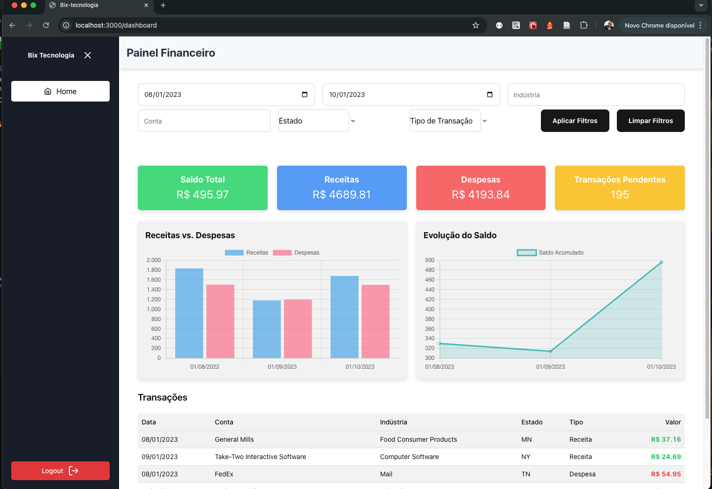

# 📊 Dashboard Financeiro

Este projeto é um **Dashboard Financeiro** desenvolvido para auxiliar usuários na análise de saldos, receitas, despesas, transações pendentes e histórico de transações. A aplicação é construída utilizando **Next.js**, **TypeScript**, **Chakra UI** e **Styled Components**, garantindo uma interface moderna, responsiva e de fácil navegação.

## 🚀 Funcionalidades

- **Autenticação de Usuário**: Sistema de login e logout para proteger o acesso à dashboard.
- **Filtros Dinâmicos**: Permite filtrar transações por data, conta, indústria e estado, atualizando o conteúdo em tempo real.
- **Resumo Financeiro**: Exibe cards com informações sobre receitas, despesas, transações pendentes e saldo total.
- **Gráficos Interativos**: Inclui gráficos de barras empilhadas e de linhas para visualização das transações.
- **Persistência de Sessão e Filtros**: Mantém a sessão do usuário e os filtros aplicados mesmo após recarregar a página.
- **Design Responsivo**: Interface adaptada para diversos dispositivos e tamanhos de tela.

## 🖼️ Visualizações

### Tela de Login


### Dashboard



## 🛠️ Tecnologias Utilizadas

- **Next.js**: Framework React para desenvolvimento de aplicações web.
- **TypeScript**: Superset do JavaScript que adiciona tipagem estática ao código.
- **Styled Components**: Biblioteca para estilização de componentes utilizando CSS-in-JS.
- **Chart.js**: Biblioteca para criação de gráficos interativos.
- **react-charts-2.js**: Biblioteca para criação de gráficos interativos.
- **AWS Amplify (Cognito)**: Plataforma da AWS utilizada para autenticação e gerenciamento de usuários.
- **Chakra UI**: Biblioteca de componentes para UI.

## 📦 Instalação e Configuração

1. Clone o repositório:

- HTTPS
  ```bash
  git clone https://github.com/chicaodw1/Bix-Tecnologia.git
  cd Bix-Tecnologia
  ```
- SSH
  ```bash
  git clone git@github.com:chicaodw1/Bix-Tecnologia.git
  cd Bix-Tecnologia
  ```

2. Instale as dependências:

   ```bash
   npm install
   ```

3. Configure as variáveis de ambiente:
   - É necessario criar uma conta na aws caso não tenha, para usar o cognito (serviço de autenticação)
   - Crie um arquivo `.env.local` na raiz do projeto com as seguintes variáveis:
   ```env
   NEXT_PUBLIC_AMPLIFY_REGION=your-region
   NEXT_PUBLIC_AMPLIFY_USER_POOL_ID=your-user-pool-id
   NEXT_PUBLIC_AMPLIFY_APP_CLIENT_ID=your-app-client-id
   ```
4. Execute a aplicação:
   ```bash
   npm run dev
   ```
5. Acesse no navegador:
   - Abra `http://localhost:3000`.

## 📂 Estrutura do Projeto

```plaintext
dashboard-financeiro/
├── public/
│   ├── financeiro.jpg
│   ├── logo.jpg
│   ├── transactions.json
├── src/
│   ├── app/
│   │   ├── (Auth)/
│   │   ├── dashboard/
│   │   ├── layout.tsx
│   │   ├── page.tsx
│   │   ├── provider.tsx
│   │   ├── styledRegistry.tsx
│   │   ├── styledconfig.tsx
│   ├── components/
│   ├── controllers/
│   ├── hooks/
│   ├── models/
│   ├── services/
│   ├── view/
├── .env.local
├── .gitignore
├── package.json
├── README.md
├── tsconfig.json
```

- `public/`: Arquivos estáticos e imagens da aplicação.
- `src/app/`: Estrutura principal do Next.js, incluindo páginas e provedores de contexto.
- `src/components/`: Componentes reutilizáveis da aplicação.
- `src/controllers/`: Camada de lógica de controle da aplicação.
- `src/hooks/`: Hooks personalizados para gerenciamento de estado e lógica compartilhada.
- `src/models/`: Definições de tipos e interfaces para dados.
- `src/services/`: Serviços para comunicação com APIs e lógica de negócios.
- `src/view/`: Componentes de visualização e containers da aplicação.
